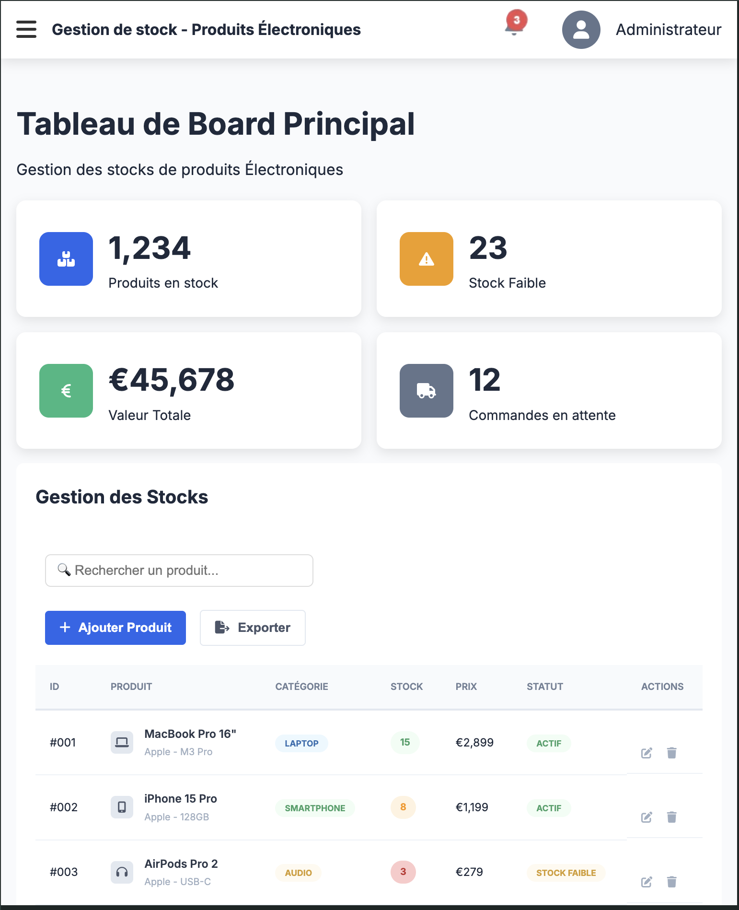

# Stock Manager

## Description
Ce projet marque l’aboutissement de votre parcours en HTML et CSS. Il vous offre l’opportunité de mettre en pratique l’ensemble de vos acquis, de consolider vos compétences et de démontrer votre maîtrise du développement web. C’est aussi l’occasion d’exprimer votre créativité, votre sens du détail et votre capacité à concevoir une interface complète, moderne et professionnelle. La video de présentation vous avez la (Partie 1), prennez le temps de regardez la (Partie 2)

### Icons source

* Font Awesome (used for social media, menu icon, services, and portfolio links)

## Compréhention

* En général ce projet m'a vraiment appris plusieurs chose comme :
* J'ai appris à faire plusieurs page dans un seul projet
* J'ai appris comment faire afficher un contenu caché si on clique sur un boutton
* J'ai appris a utiliser la propriété css `:target`
* J'ai appris a utiliser la propriété css `:checked`
* J'ai appris a utiliser la propriété css `grid`
* J'ai appris a utiliser la propriété css `:before`
* J'ai aussi apris à débuguer mon propre code

## Lien du Github Page

## Capture du projet

### Format desktop

### Format Tablette 

# Auteure : Mohamed Attahir Ibrahim Diallo

